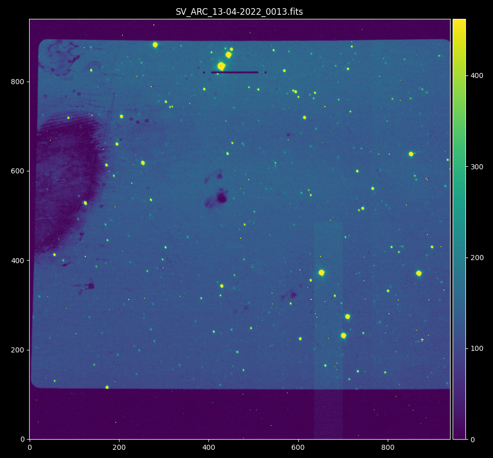

.. TripleSpec Focus documentation master file, created by
   sphinx-quickstart on Tue Apr 19 16:26:36 2022.
   You can adapt this file completely to your liking, but it should at least
   contain the root `toctree` directive.

Welcome to TripleSpec Focus's documentation!
============================================

.. image::  https://github.com/soar-telescope/triplespec_focus/actions/workflows/python-package.yml/badge.svg
    :alt: TripleSpec Focus
    :target: https://github.com/soar-telescope/triplespec_focus/actions/workflows/python-package.yml
.. image::  https://codecov.io/gh/soar-telescope/triplespec_focus/branch/main/graph/badge.svg?token=S6Y6R7AQNY
    :alt: Codecov
    :target: https://codecov.io/gh/soar-telescope/triplespec_focus
.. image::  https://github.com/soar-telescope/triplespec_focus/actions/workflows/python-publish.yml/badge.svg
    :alt: Upload to PYPI
    :target: https://github.com/soar-telescope/triplespec_focus/actions/workflows/python-publish.yml
.. image::  https://readthedocs.org/projects/triplespec-focus/badge/?version=latest
    :alt: Documentation Status
    :target: https://triplespec-focus.readthedocs.io/en/latest/?badge=latest
.. image::  https://img.shields.io/pypi/v/triplespec_focus.svg?style=flat
    :alt: pypi
    :target: https://pypi.org/project/triplespec-focus/
.. image::  https://github.com/soar-telescope/triplespec_focus/actions/workflows/codeql-analysis.yml/badge.svg
    :alt: CodeQL
    :target: https://github.com/soar-telescope/triplespec_focus/actions/workflows/codeql-analysis.yml
.. image::  https://img.shields.io/badge/Python-3.8-blue.svg
    :alt: Python 3.8
    :target: https://www.python.org/downloads/release/python-380/
.. image::  https://img.shields.io/github/license/soar-telescope/triplespec_focus
    :alt: Licence
    :target: https://github.com/soar-telescope/triplespec_focus/blob/main/LICENSE

Test Coverage
=============

.. image:: https://codecov.io/gh/soar-telescope/triplespec_focus/branch/main/graphs/sunburst.svg?token=S6Y6R7AQNY
    :alt: Test Coverage

Overview
========

This is a tool to obtain the best focus value for the Slit Viewer camera of the TripleSpec NIR spectrograph.
More information on TripleSpec can be found at `NOIRLab Official Website <https://noirlab.edu/science/programs/ctio/instruments/triplespec41-nir-imaging-spectrograph>`_

TripleSpec is a fixed configuration, this means that it has a fixed focus with respect to the telescope, but there is a
slit viewing Camera that need focus adjustment.

A slit viewing image looks like this:

The slit is visible near the top center.

.. toctree::
   :maxdepth: 2
   :caption: How to install

   install

.. toctree::
   :maxdepth: 2
   :caption: How to use it

   data_overview
   Using in a Terminal <use_from_terminal>
   Using as a Library <use_as_library>

.. toctree::
   :maxdepth: 2
   :caption: About

   about

Indices and tables
==================

* :ref:`genindex`
* :ref:`modindex`
* :ref:`search`
