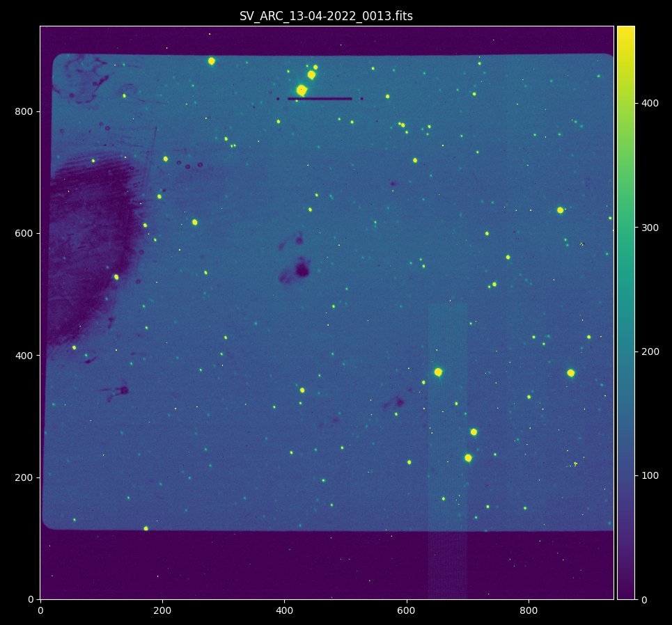

Overview
########

This is a tool to obtain the best focus value for the Slit Viewer camera of the TripleSpec NIR spectrograph.
More information on TripleSpec can be found at `NOIRLab Official Website <https://noirlab.edu/science/programs/ctio/instruments/triplespec41-nir-imaging-spectrograph>`_

TripleSpec is a fixed configuration, this means that it has a fixed focus with respect to the telescope, but there is a
slit viewing Camera that need focus adjustment.

A slit viewing image looks like this:

The slit is visible near the top center.