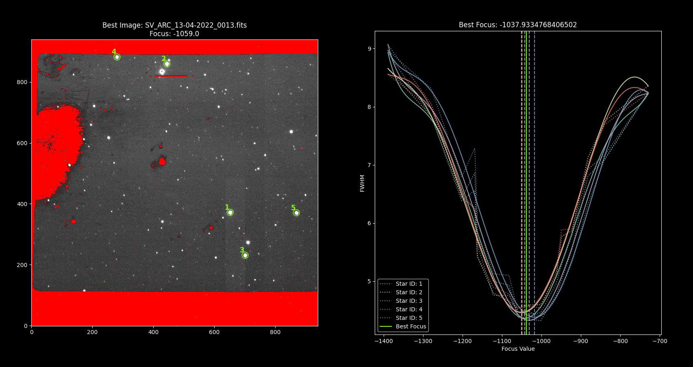

Using as a Library
##################

This library can be integrated into other software, just import ``TripleSpecFocus`` create an instance and call it.

.. code-block:: python

   from triplespec_focus import TripleSpecFocus

   focus = TripleSpecFocus(debug=False,
                           date_key='DATE',
                           date_time_key='DATE-OBS',
                           focus_key='TELFOCUS',
                           filename_key='FILENAME',
                           file_pattern='*.fits',
                           n_brightest=5,
                           saturation=40000,
                           plot_results=False,
                           debug_plots=False)

Since in this case all the parameters are the default ones it is equivalent to do:

.. code-block:: python

   from triplespec_focus import TripleSpecFocus

   focus = TripleSpecFocus()

Once the instance is created you can just call it or you can modify certain parameters.

.. code-block:: python

   results = focus()

or

.. code-block:: python

   from pathlib import Path

   data_path = Path('./')

   results = focus(data_path=data_path,
                   source_fwhm=7.0,
                   det_threshold=5.0,
                   mask_threshold=1,
                   n_brightest=5,
                   saturation_level=40000,
                   show_mask=False,
                   plot_results=False,
                   debug_plots=False,
                   print_all_data=False)

Usually you would want to have more control so you can modify any parameters, but the most interesting
part is that you can pass a list of files.

Using the same ``data_path`` variable created in the previous example

.. code-block:: python

   file_list = sorted(data_path.glob(pattern='*.fits'))

or create the list manually or programatically

.. code-block:: python

   file_list = [
   '/path/to/file_001.fits',
   '/path/to/file_003.fits',
   '/path/to/file_007.fits',
   '/path/to/file_008.fits',
   '/path/to/file_010.fits',
   '/path/to/file_012.fits',
   ]

   results = focus(file_list=file_list,
                   source_fwhm=7.0,
                   det_threshold=5.0,
                   mask_threshold=1,
                   n_brightest=5,
                   saturation_level=40000,
                   show_mask=False,
                   plot_results=False,
                   debug_plots=False,
                   print_all_data=False)

Interpreting the Results
########################

Using the option ``--plot-results``  or set ``plot_results=True`` you will get the following information at the end.

The sources used are plotted to the left and to the right you get the data and fitted models plot. The dashed vertical
lines represent the best focus for each individual star. The solid vertical line represent the
best focus value.

The result is a  dictionary.

.. code-block:: python

   {
        "date": "2022-04-14",
        "time": "2022-04-14T02:00:16.472",
        "mean_focus": -1037.9334768407,
        "median_focus": -1042.3437309744,
        "focus_std": 12.4463329703,
        "fwhm": 4.400507903,
        "best_image_name": "SV_ARC_13-04-2022_0013.fits",
        "best_image_focus": -1059.0,
        "best_image_fwhm": 4.451495851,
        "focus_data": [
            -1389.0,
            -1279.0,
            -1202.0,
            -1169.0,
            -1162.0,
            -1122.0,
            -1081.99,
            -1059.0,
            -1042.0,
            -1002.0,
            -962.0,
            -949.0,
            -922.0,
            -882.0,
            -839.0,
            -729.0
        ],
        "fwhm_data": [
            8.8346668203,
            7.9968682153,
            6.520501982,
            6.6366621644,
            5.6593294617,
            4.9156293967,
            4.8462257042,
            4.451495851,
            4.4960399387,
            4.4620697186,
            4.9432397845,
            5.3684107482,
            5.6873559877,
            6.8445617244,
            7.3650931863,
            8.2617132835
        ]
    }
