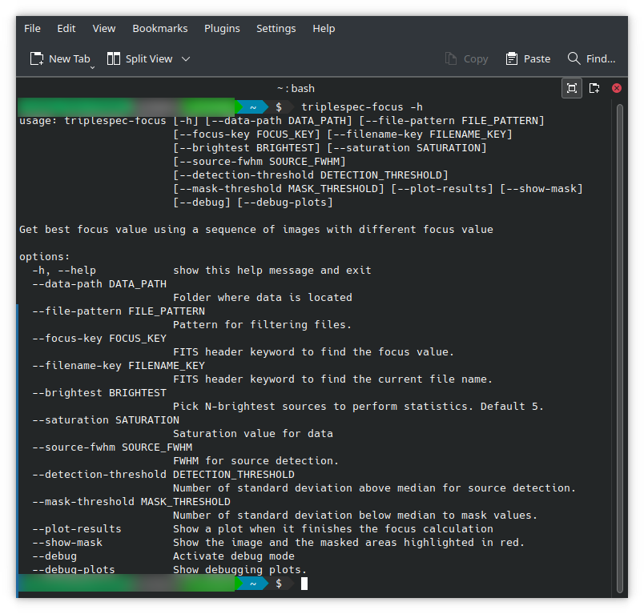

Use from terminal
#################

The installation will create a terminal entrypoint ``triplespec-focus``

Getting help is as easy as running with the ``-h`` argument:

If you run ``triplespec-focus`` from the same data folder as the location of the data, you don't need to specify any
argument.

The arguments, default values and options are listed in the following table:

.. table:: Default values for arguments

  ====================================== ============================ ========================
        Argument                              Default Value               Options
  ====================================== ============================ ========================
   ``--data-path <input>``                Current Working Directory    Any valid path
   ``--file-pattern <input>``             ``*.fits``                   Any pattern
   ``--focus-key <input>``                ``TELFOCUS``                 Any valid FITS keyword
   ``--filename-key <input>``             ``FILENAME``                 Any valid FITS keyword
   ``--brightest <input>``                :math:`5`                    Any positive integer
   ``--saturation <input>``               :math:`40000`                Any positive float
   ``--source-fwhm <input>``              :math:`7`                    Any positive float
   ``--detection-threshold <input>``      :math:`5`                    Any positive float
   ``--plot-results``                     False                        True
   ``--show-mask``                        False                        True
   ``--debug``                            False                        True
   ``--debug-plots``                      False                        True
  ====================================== ============================ ========================

After running the script with all desired parameters the result will be printed in the terminal.
